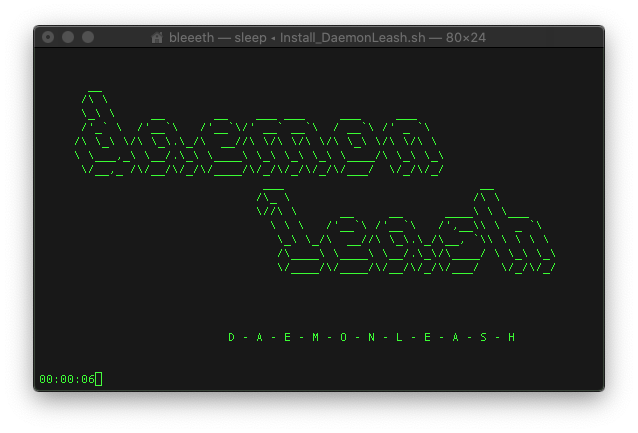

<strong>A word in advance: we stopped using Adobe a while ago and we found software alternatives that cover all our needs. This is the reason why we also stopped to maintain this script. Adobe might have changed its background processes (this script is looking for Adobe background processes), which is why this script might not catch all of them anymore...</strong>

# RELATED CONTENT ON OUR WEBSITE:

[https://term7.info/6-reasons-to-stop-using-adobe-cc/](https://term7.info/6-reasons-to-stop-using-adobe-cc/)<br>
[https://term7.info/daemonleash/](https://term7.info/daemonleash/)

* * *

# DaemonLeash for OS X

We have been using Adobe Creative Cloud (for Mac OSX) for quite a while now and it came to our attention that several background processes connect to Adobe Servers to send out data as soon as we start our Computer (even though we did not start any Adobe Application). Google Chrome does behave exactly the same way. These processes require processing power that we want to use in other ways. Yes, background processes check for updates too - yet we prefer to check for updates manually.

But most importantly we do value our privacy. The average user does not exactly know what data is being collected by big Software Corporations, even though i.e. Adobe claims only to collect data to improve its products. Yet we think it already is intolerable that Adobe and Google automatically know when, where and for how long we use our computers just because we have their software installed on our system. We want to limit the collection of our data as much as we can.

This is why we wrote DaemonLeash.

Whenever you start your computer DaemonLeash checks for both Adobe and Google Launch Daemons and disables them before they can connect to the internet. It also keeps listening in the background while you are using your favorite Adobe Application and terminates any persitent Adobe Backgound Process as soon as you finish actively using the software.
We did not implement a backgound listener for Google Processes, because we don't use Google Chrome. We recommend you use Mozilla Firefox or the Tor Browser. However we added Google Chrome as an example to show how DaemonLeash could be configured to target other background processes as well.
Our script uses much less CPU power than the average Adobe background process. DaemonLeash consists of a Launch Daemon, a Launch Agent, four Shell Scripts and a Log File.

To make things easy for the average user who is not necessarily familiar with the command line, we wrote one single install script that sets up DeamonLeash for you. If you don't want to use DaemonLeash anymore, you can easily remove it with our uninstall script.

Right now DaemonLeash targets Adobe CC and Google, yet it can easily be changed to unload other LaunchDaemons as well.

<p align="center">
  
</p>


### WHAT DAEMONLEASH IS NOT MEANT TO DO

DeamonLeash is meant to enhance your privacy and to free CPU power on your MAC. It is not meant to aid you in cracking Adobe CC. If you don't want to pay for Adobe products (which we totally understand) we encourage you to terminate your Adobe subscription and to find alternative software.


## PREREQUISITES & INSTALLATION

We are using MacPorts, which is why this script will use the MacPorts directory as an install location. You may have to install MacPorts before you attempt to install DeamonLeash, or edit Install_DaemonLeash.sh to match your preferred install location.

* [https://www.macports.org/install.php](https://www.macports.org/install.php)
    
Install_DaemonLeash.sh is a script that will set up DaemonLeash for you. Simply execute it, i.e. open a terminal window, type 'sudo sh ' - then drag and drop the installation script into the same terminal window and press ENTER. When prompted type your admin password and press ENTER again. The script will run all necessary commands for you. You can review the whole installation process in your terminal window. Alternatively change into the directory where you stored the script (cd /path/to/file/location), then type: 

```
sudo sh Install_DaemonLeash.sh
```

DeamonLeash will now automatically run on your Mac whenever you start your computer. To check the current DaemonLeash log file (to see whether or not all Adobe Processes have been terminated, or which processes are still runnig while you are using Adobe CC), enter this command into a Terminal Window:

```
cat /Users/Shared/Enhancements/DaemonLeash/DaemonLeash.log
```

If you don't want to use DaemonLeash anymore, simply execute Remove_DaemonLeash.sh to purge DaemonLaesh and all related scripts and daemons from your system.


## ADOBE PRIVACY POLICY

QUOTE:

*"Under the law of some countries, you may have the right to ask us for a copy of your personal information; to correct, delete or restrict (stop any active) processing of your personal information; and to obtain the personal information you provide to us for a contract or with your consent in a structured, machine readable format, and to ask us to share (port) this information to another controller.
In addition, you can object to the processing of your personal information in some circumstances (in particular, where we don’t have to process the information to meet a contractual or other legal requirement, or where we are using the information for direct marketing).
These rights may be limited, for example, if fulfilling your request would reveal personal information about another person, or if you ask us to delete information which we are required by law to keep or have compelling legitimate interests in keeping (such as fraud prevention purposes).
To exercise any of these rights (including deactivating your Adobe ID account), you can get in touch with us – or our data protection officer – using the details set out below.
If you have unresolved concerns, you have the right to report them to an EU or other data protection authority where you live, work or where you believe a potential violation may have occurred."*

You can find Adobe's full Privacy Policy here:

* [https://www.adobe.com/privacy/policy.html#rights](https://www.adobe.com/privacy/policy.html#rights)
* [https://www.adobe.com/privacy/policies.html](https://www.adobe.com/privacy/policies.html)
* [https://www.adobe.com/privacy/cookies.html](https://www.adobe.com/privacy/cookies.html)
* [https://www.adobe.com/privacy/general-data-protection-regulation.html](https://www.adobe.com/privacy/general-data-protection-regulation.html)


You can request a copy of all your data collected by Adobe here:

* privacy inquiry form: [https://www.adobe.com/privacy/privacy-contact.html](https://www.adobe.com/privacy/privacy-contact.html)
* email: [DPO@adobe.com](mailto:DPO@adobe.com)


## Please Note

Both Adobe and Google may automatically install Plugins and Startup Items on your Computer. You can disable them at any time:

Open your System Preferences, select Users & Groups and your Admin Account, then click the small lock in the bottom left corner and type in your password. Select Login Items and remove all apps that you don't want to start whenever you log in (select the app and click -). We recommend you disable Creative Cloud on startup and only start it when you need to update Adobe CC.

Next, go back to System Preferences, click on Extensions and for each Plugin you want to disable remove the respective hook by clicking on it. 

If you further want to monitor, maybe even block outgoing connections of active apps, that send data from your computer to their developers while you are using them, we recommend you purchase Little Snitch. Little Snitch is a host-based application firewall for macOS. It can be used to monitor apps, preventing or permitting them to connect to attached networks through advanced rules. A Single License costs about \$45/45€/£45.

* [https://www.obdev.at/index.html](https://www.obdev.at/index.html)
    
ADOBE ALLOWS ACTIVE SUBSCRIBERS TO USE CREATIVE CLOUD WITH A VALID LICENSE OFFLINE ONLY FOR A LIMITED PERIOD OF TIME: THE SO-CALLED GRACE PERIOD. DURING THIS TIME YOU CAN USE LITTLE SNITCH TO BLOCK ALL OUTGOUNING ADOBE TRAFFIC AND USE ADOBE CC AS IF YOU WERE NOT CONNECTED TO THE INTERNET.

As soon as Adobe CC reminds you that you have to reconnect to the Internet to validate you subscription, briefly disable LittleSnitch and allow Adobe CC to reconnect to the Adobe Servers. Afterwards restart LittleSnitch to shut down Adobe CC again (until the next grace period ends).

* [https://helpx.adobe.com/creative-cloud/kb/internet-connection-creative-cloud-apps.html](https://helpx.adobe.com/creative-cloud/kb/internet-connection-creative-cloud-apps.html)

## MIT License

Copyright (c) 2019

Permission is hereby granted, free of charge, to any person obtaining a copy of this software and associated documentation files (the "Software"), to deal in the Software without restriction, including without limitation the rights to use, copy, modify, merge, publish, distribute, sublicense, and/or sell copies of the Software, and to permit persons to whom the Software is furnished to do so, subject to the following conditions:

The above copyright notice and this permission notice shall be included in all copies or substantial portions of the Software.

THE SOFTWARE IS PROVIDED "AS IS", WITHOUT WARRANTY OF ANY KIND, EXPRESS OR IMPLIED, INCLUDING BUT NOT LIMITED TO THE WARRANTIES OF MERCHANTABILITY, FITNESS FOR A PARTICULAR PURPOSE AND NONINFRINGEMENT. IN NO EVENT SHALL THE AUTHORS OR COPYRIGHT HOLDERS BE LIABLE FOR ANY CLAIM, DAMAGES OR OTHER LIABILITY, WHETHER IN AN ACTION OF CONTRACT, TORT OR OTHERWISE, ARISING FROM, OUT OF OR IN CONNECTION WITH THE SOFTWARE OR THE USE OR OTHER DEALINGS IN THE SOFTWARE.

### **MIRRORS**

This repository is actively maintained on Codeberg:<br>
https://codeberg.org/term7/DaemonLeash

Changes are puhsed regularly to our Githoub Mirror:<br>
https://github.com/term7/DaemonLeash